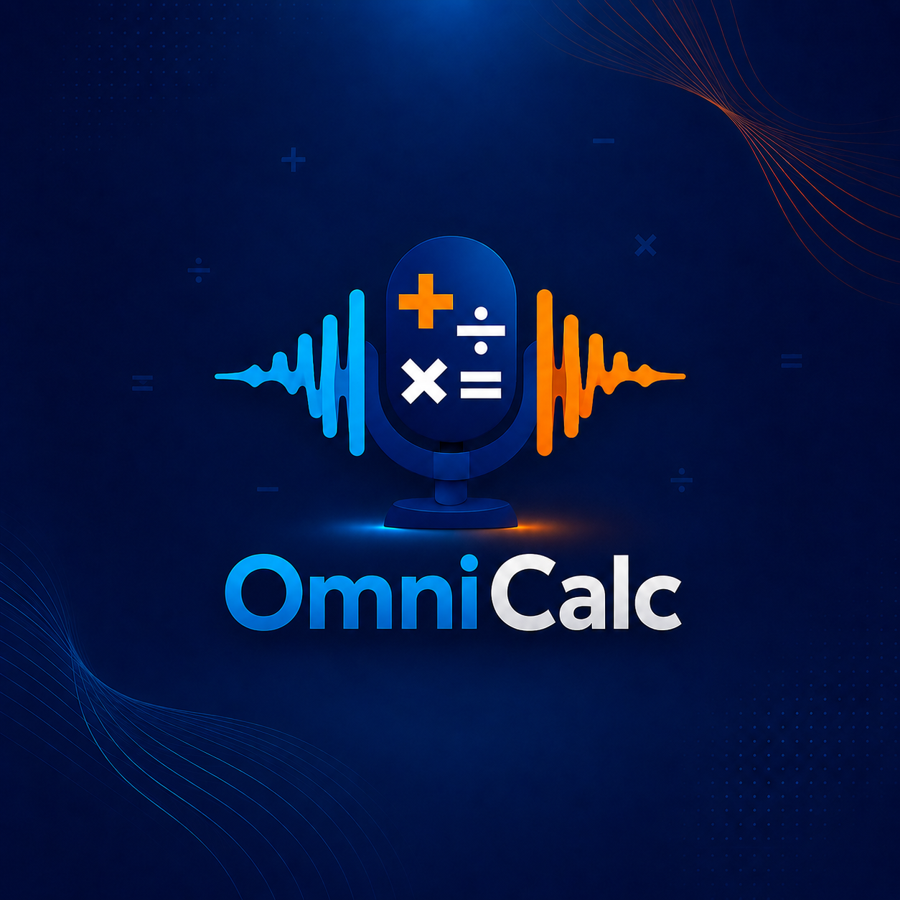
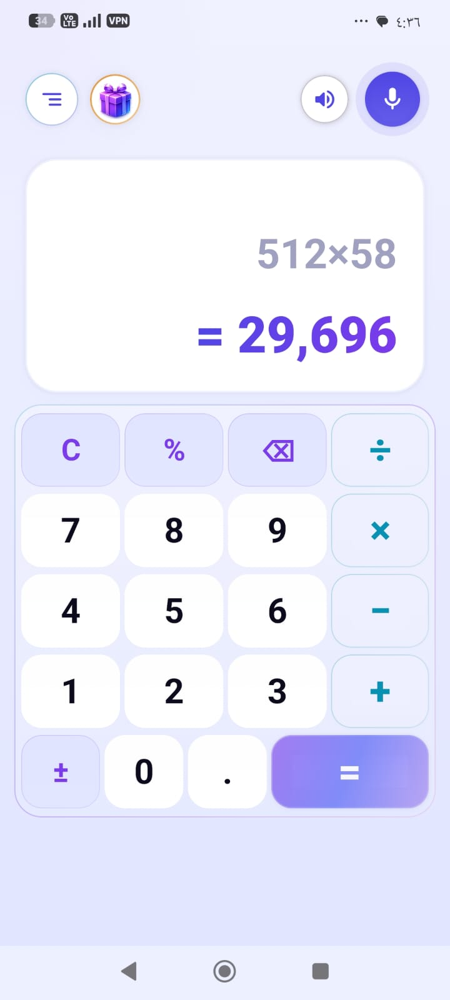
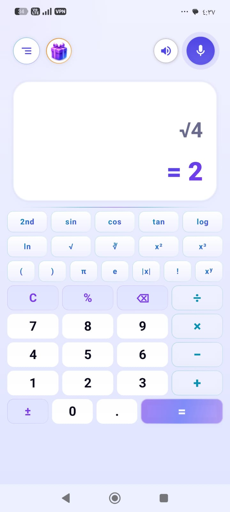
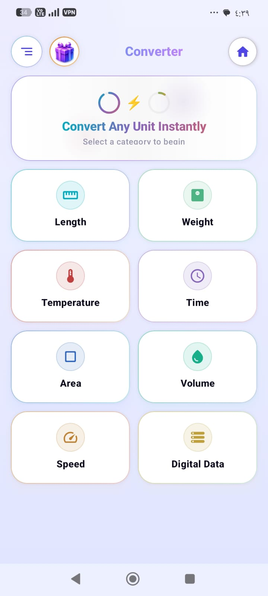
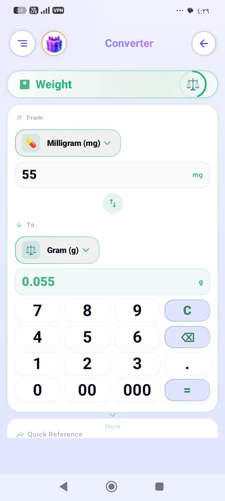
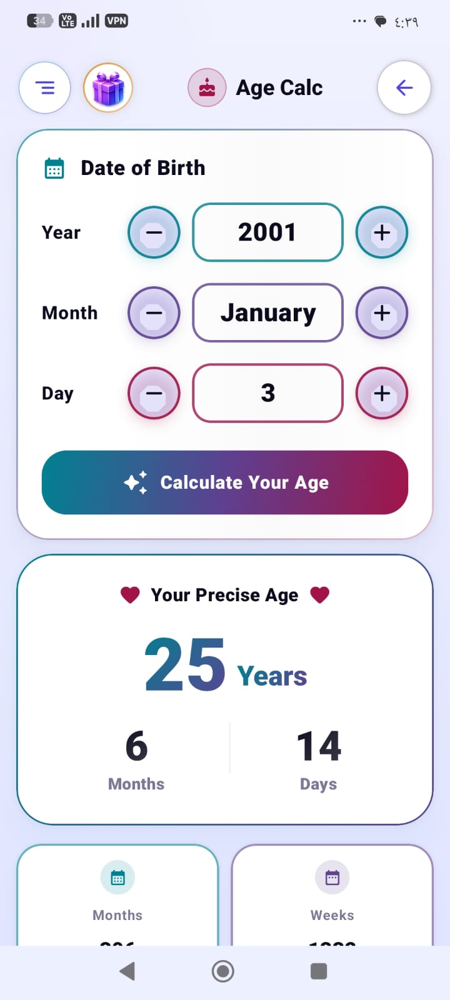
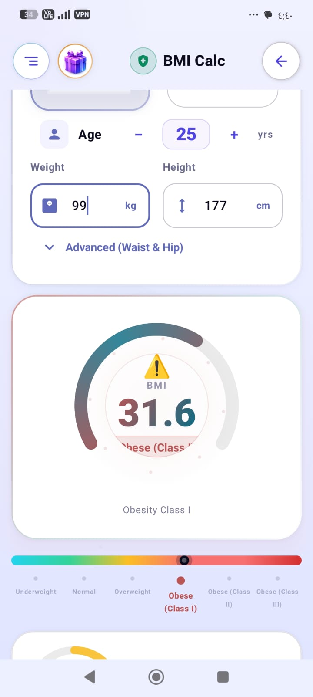
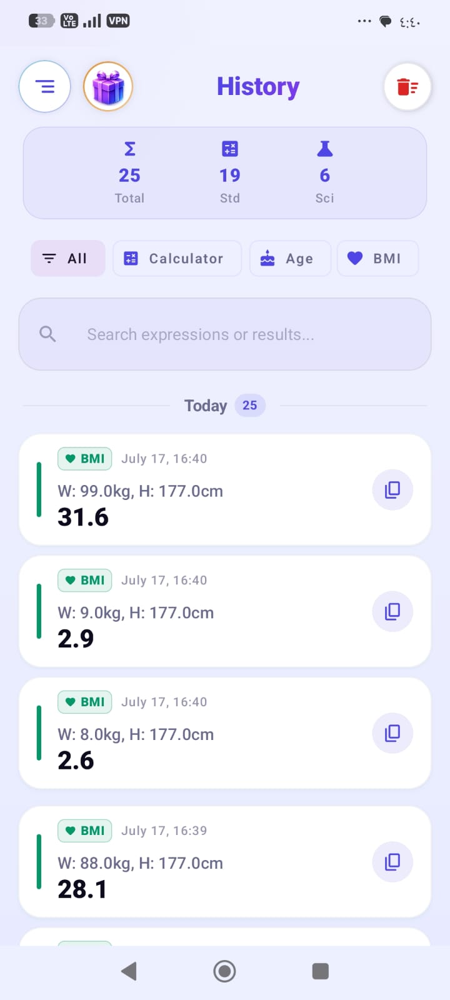
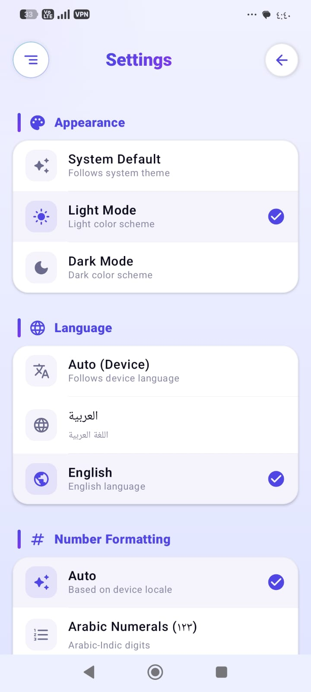

<p align="center">
  
</p>

<h1 align="center">OmniCalc</h1>

<p align="center">
  <strong>Powerful All-in-One Calculator for Android</strong>
</p>

<p align="center">
  Scientific Calculator • Standard Calculator • Voice Calculator • BMI Calculator • Age Calculator • Unit Converter
</p>

<p align="center">


</p>

---

# 📱 Overview

**OmniCalc** is a modern all-in-one calculator for Android that combines multiple powerful tools into one elegant application.

It supports both **English** and **Arabic**, automatic language detection, Material 3 design, Dark & Light themes, voice input, scientific calculations, health tools, and much more.

---

# ✨ Features

* 🧮 Standard Calculator
* 🔬 Scientific Calculator
* 🎤 Voice Calculator (Arabic & English)
* ❤️ BMI Calculator
* 🎂 Age Calculator
* 📏 Unit Converter
* 🕒 Calculation History
* 🌙 Light & Dark Theme
* 🌐 Arabic & English
* 📱 Material 3 Design
* ⚡ Fast & Smooth Performance

---

# 📸 Screenshots

## 🧮 Standard Calculator



---

## 🔬 Scientific Calculator



---

## 📏 Unit Converter



---

## 📐 More Unit Converter



---

## 🎂 Age Calculator



---

## ❤️ BMI Calculator



---

## 🕒 History



---

## ⚙️ Settings



---

# 📥 Download

Download the latest APK from GitHub Releases:

➡️ **https://github.com/ghassanstudio/OmniCalc/releases/latest**

---

# 📱 Requirements

* Android 6.0 (API 23) or higher

---

# 🔒 Privacy Policy

https://ghassanstudio.github.io/OmniCalc-Privacy-Policy/

---

# 🛠 Built With

* Kotlin
* Jetpack Compose
* Material 3
* Android ViewModel
* Navigation Component
* DataStore
* SpeechRecognizer
* TextToSpeech
* Start.io SDK

---

# 🚀 Highlights

* Beautiful Material 3 interface
* Scientific and Standard calculators
* Voice calculations in Arabic & English
* Smart Unit Converter
* BMI Calculator
* Age Calculator
* Calculation History
* Automatic language detection
* RTL & LTR support
* Dark & Light themes
* Optimized for phones and tablets

---

# 👨‍💻 Developer

**Ghassan Studio**

📧 Email:

[ghassan25vun@gmail.com](mailto:ghassan25vun@gmail.com)

Package Name:

```text
com.ghassanstudio.omnicalc
```

---

# 📄 License

This project is licensed under the MIT License.

---

<p align="center">

Made with ❤️ using Kotlin & Jetpack Compose

</p>
